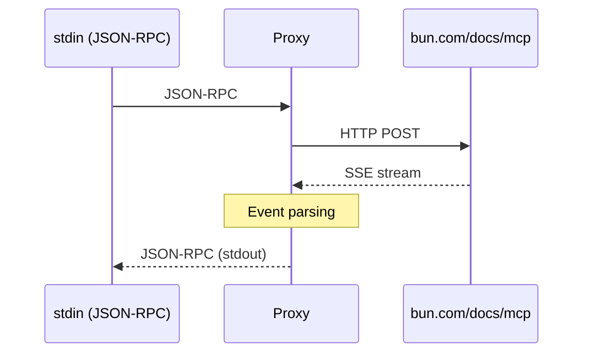

# Bun Docs MCP Proxy

[][ci.yml]
[][release.yml]
[][codecov]

Native Rust proxy for Bun documentation MCP context server. Bridges Zed's stdio-based MCP client with the Bun HTTP MCP
server at `https://bun.com/docs/mcp`.

## Features

- [x] **Zero runtime dependencies** - Single native binary
- [x] **Tiny binary** — 2.7 MB with TLS support
- [x] **Fast startup** — 4ms cold start
- [x] **Low memory** — ~2-5 MB RSS
- [x] **Standard protocols** — JSON-RPC 2.0 + Server-Sent Events
- [x] **Production-ready** — Comprehensive error handling and logging

## Building

```bash
task br  # or: cargo build --release
```

The binary will be at `target/release/bun-docs-mcp-proxy`.

## Running

```bash
./target/release/bun-docs-mcp-proxy
```

Reads JSON-RPC 2.0 messages from stdin, forwards to `bun.com/docs/mcp`, and writes responses to stdout.

## Testing

This project uses a **dual testing strategy**: fast unit tests by default, with opt-in integration tests for comprehensive validation. See [.github/TESTING.md](.github/TESTING.md) for detailed documentation.

### Quick Start

```bash
# Run unit tests only (fast, no network)
task t  # or: cargo test

# Run integration tests (requires network)
task tio  # or: cargo test --features integration-tests

# Run all tests including integration
task twi  # or: cargo test --all-features
```

### Test Strategy

- **Unit Tests** (Default): Fast, mocked tests that run in ~2-3 seconds without network calls
- **Integration Tests** (Opt-in): Real API tests against `bun.com/docs/mcp`, run daily in CI or manually

### CI/CD

- **Every commit**: Runs unit tests only (fast, reliable)
- **Daily + Manual**: Integration tests via [scheduled workflow](.github/workflows/integration-tests.yml)
- **Coverage**: Tracked separately for unit and integration tests

### Code Coverage

**Current Coverage: ~86%** (with mocked unit tests)

Generate HTML coverage report:

```bash
task covh
# Opens target/llvm-cov/html/index.html
```

Show coverage summary in terminal:

```bash
task covt
# Or: cargo llvm-cov
```

Generate coverage in different formats:

```bash
# JSON format (for CI)
task coverage-nextest
# Generates codecov.json

# LCOV format
cargo llvm-cov --lcov --output-path lcov.info

# Cobertura XML format
cargo llvm-cov --cobertura --output-path cobertura.xml
```

### JUnit Test Results

For JUnit XML test results (separate from coverage):

```bash
task tn  # or: cargo nextest run --all-features --workspace --profile ci
# Generates target/nextest/ci/junit.xml
```

### Manual Testing

Test specific MCP methods:

```bash
# Initialize
task test-mcp-init

# List tools
task test-mcp-tools-list

# Call SearchBun tool
task test-mcp-tools-call

# List resources
task test-mcp-resources-list

# Read resource
task test-mcp-resources-read

# Run all manual tests
task test-mcp-all
```

### Development Tools

Install recommended dev tools:

```bash
task install-tools
# Installs: cargo-llvm-cov, cargo-nextest, cargo-watch, cargo-zigbuild, llvm-tools-preview
```

Watch mode for continuous testing:

```bash
task watch
# Or: cargo watch -x test
```

## Logging

Set `RUST_LOG` environment variable for verbose logging:

```bash
# Info level (default)
./target/release/bun-docs-mcp-proxy

# Debug level (verbose)
RUST_LOG=debug ./target/release/bun-docs-mcp-proxy

# Trace level (very verbose)
RUST_LOG=trace ./target/release/bun-docs-mcp-proxy
```

Logs are written to stderr (Zed captures this for extension logs).

## Architecture



### Module Structure

- **`src/main.rs`** - Main proxy loop and request handling
- **`src/transport/`** - Stdin/stdout communication
- **`src/protocol/`** - JSON-RPC 2.0 types
- **`src/http/`** - Bun Docs API client with SSE parsing

## Supported Methods

### `initialize`

Initializes the MCP connection. Returns server info and capabilities.

```json
{
  "jsonrpc": "2.0",
  "id": 1,
  "method": "initialize",
  "params": {}
}
```

### `tools/list`

Lists available tools (SearchBun).

```json
{
  "jsonrpc": "2.0",
  "id": 1,
  "method": "tools/list"
}
```

### `tools/call`

Searches Bun documentation.

```json
{
  "jsonrpc": "2.0",
  "id": 1,
  "method": "tools/call",
  "params": {
    "name": "SearchBun",
    "arguments": {
      "query": "your search query"
    }
  }
}
```

## Dependencies

| Crate                  | Purpose            | Features Used                            |
| ---------------------- | ------------------ | ---------------------------------------- |
| **tokio**              | Async runtime      | rt-multi-thread, io-std, io-util, macros |
| **reqwest**            | HTTP client        | json, stream, rustls-tls                 |
| **eventsource-stream** | SSE parsing        | (default)                                |
| **serde_json**         | JSON serialization | (default)                                |
| **anyhow**             | Error handling     | (default)                                |
| **tracing**            | Structured logging | (default)                                |
| **tracing-subscriber** | Log formatting     | env-filter                               |
| **futures**            | Stream utilities   | (default)                                |

## Performance

**Measured on Linux x86_64 (Manjaro 6.16.12)**:

| Metric       | Value   | Target  | Status            |
| ------------ | ------- | ------- | ----------------- |
| Binary Size  | 2.7 MB  | < 5 MB  | ✅ **46% under**  |
| Startup Time | 4 ms    | < 10 ms | ✅ **60% faster** |
| Memory Usage | ~2-5 MB | < 10 MB | ✅ Within target  |
| Request Time | ~400ms  | N/A     | ✅ Network-bound  |

### Comparison with TypeScript Proxy

| Metric       | TypeScript (Bun)        | Rust Native | Improvement       |
| ------------ | ----------------------- | ----------- | ----------------- |
| Binary Size  | ~50 MB (Bun runtime)    | 2.7 MB      | **95% smaller**   |
| Startup Time | ~100-200 ms             | 4 ms        | **25-50x faster** |
| Memory Usage | ~30-50 MB               | ~2-5 MB     | **10x less**      |
| Runtime Deps | Bun or Node.js required | None        | ✅ Standalone     |

## Error Handling

The proxy handles errors gracefully and returns proper JSON-RPC error responses:

| Error Code | Meaning          | When                      |
| ---------- | ---------------- | ------------------------- |
| `-32700`   | Parse error      | Invalid JSON              |
| `-32601`   | Method not found | Unknown method            |
| `-32603`   | Internal error   | HTTP failures, SSE errors |

## Building for Other Platforms

### Native Builds

```bash
# Linux x86_64 (GNU)
task build-linux-gnu

# macOS Intel
task build-macos-intel

# macOS Apple Silicon
task build-macos-arm

# Windows x86_64
task build-windows
```

### Cross-Compilation (requires cargo-zigbuild)

```bash
# Linux ARM64
task build-linux-arm64

# Linux x86_64 (musl, static)
task build-linux-musl

# Linux ARM64 (musl, static)
task build-linux-arm64-musl
```

### All Platforms

```bash
# Build all native targets
task build-all-native

# Build all cross-compilation targets
task build-all-cross
```

## License

[MIT][license]

## Development

Built with:

- Rust 1.81.0+
- Cargo + [Task](https://taskfile.dev) for build automation
- Standard async Rust ecosystem

### Quick Commands

```bash
# List all available tasks
task --list-all

# Build + test + lint
task c  # or: task check

# Watch mode (auto-rebuild)
task dev

# Run CI checks locally
task ci

# Show current version
task version
```

See [docs/protocol-analysis.md][protocol-analysis.md] for protocol details.  
See [docs/rmcp-evaluation.md][rmcp-evaluation.md] for architecture decisions.

<!--Link defs-->

[ci.yml]: https://github.com/kjanat/bun-docs-mcp-proxy/actions/workflows/ci.yml
[codecov]: https://codecov.io/gh/kjanat/bun-docs-mcp-proxy
[license]: ./LICENSE
[protocol-analysis.md]: https://github.com/kjanat/bun-docs-mcp-zed/blob/16daa944a9fb12d58a19c23751f5b4bb18fb3a68/docs/protocol-analysis.md
[release.yml]: https://github.com/kjanat/bun-docs-mcp-proxy/actions/workflows/release.yml
[rmcp-evaluation.md]: https://github.com/kjanat/bun-docs-mcp-zed/blob/16daa944a9fb12d58a19c23751f5b4bb18fb3a68/docs/rmcp-evaluation.md
